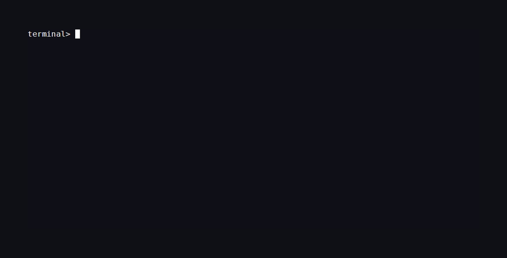
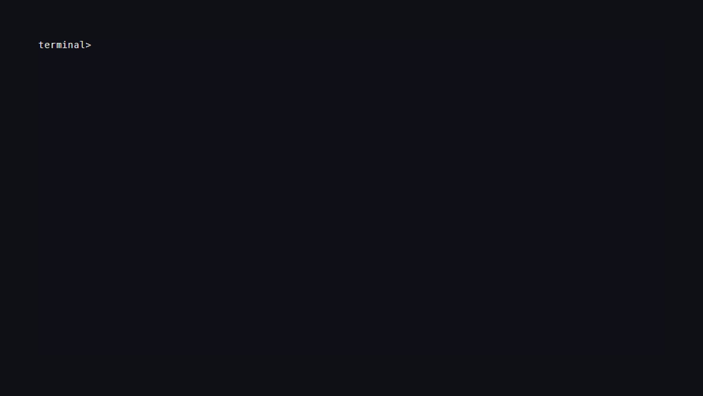

<h1 align="center">go-decide</h1>

<p align="center">
  Ask typed questions about a piece of text.<br>
  Get calibrated probabilities back.
</p>

<p align="center">
  <a href="https://pkg.go.dev/github.com/FlameInTheDark/go-decide"></a>
  <a href="https://github.com/FlameInTheDark/go-decide/blob/main/LICENSE"></a>
</p>

<p align="center">
  
</p>

<p align="center">
  <sub>Triage with a local <a href="https://ollama.com">Ollama</a> decision model, or a hosted one via OpenRouter.</sub>
</p>

---

Asking a chat model for JSON is guesswork. You declare **questions** with
explicit criteria instead, and get back typed answers with full probability
distributions.

## Install

```sh
go get github.com/FlameInTheDark/go-decide

ollama pull nimble   # decision models need Ollama v0.35.0 or later
```

## Use it

```go
result, err := ollama.New().Decide(ctx, decide.Request{
	Model: "nimble",
	State: decide.Text("Our checkout has returned 500 errors since 9am."),
	Questions: []decide.Question{
		decide.Choice("label", "Which label fits this ticket?", decide.Options{
			"billing": "Payments and refunds",
			"bug":     "Software errors",
			"account": "Login and account access",
		}),
		decide.Noul("is_urgent", "Does this need immediate attention?"),
		decide.Score("urgency", "How urgent is this ticket?", decide.Scale{
			"Can wait for the next release",
			"Should be fixed this week",
			"Blocking revenue right now",
		}),
	},
})

label, _ := result.Choice("label")
fmt.Println(label.Key, label.Probability(label.Key)) // bug 0.9781

urgency, _ := result.Score("urgency")
fmt.Println(urgency.Score, urgency.Description(urgency.Level()))
// 1.9920 Blocking revenue right now
```

Swapping backends is a one-liner, everything else stays the same:

```go
result, err := openrouter.New(openrouter.WithAPIKey(key)).Decide(ctx, req)
```

## Question types

| Type     | You provide                     | You get back                                       |
| -------- | ------------------------------- | --------------------------------------------------- |
| `choice` | 2–26 options with descriptions  | the winner, and every option's probability          |
| `noul`   | a yes/no question               | the probability that it is *true*                   |
| `score`  | 2–26 ordered levels, low → high | the weighted average, and per-level probabilities   |

> [!TIP]
> `Confidence` measures how peaked a distribution is, **not** whether the answer
> is right. For routing, `choice.Margin()` — the gap between the top two
> options — is often steadier.

## Command line

```sh
go install github.com/FlameInTheDark/go-decide/cmd/decide@latest
```

```sh
decide "Our checkout has been returning 500 errors since 9am."
```

<p align="center">
  
</p>

Questions are built from flags. Nothing is filled in behind your back: a
`--scale` without `--level` is an error rather than a silent built-in rubric.

```sh
decide "I cannot reset my password." \
  --choice-name category \
  --choice-instructions "Which team should own this?" \
  --option "bug:Broken software" \
  --option "billing:Money problems" \
  --option "account:Login issues" \
  --noul "refund:Is money back requested?" \
  --yes "Yes, refund" \
  --no "No refund" \
  --scale "urgency:How urgent?" \
  --level "Annoying" \
  --level "Blocking"
```

| Flag | Value | Builds |
| --- | --- | --- |
| `-o`, `--option` | `key:description` | a choice option, 2 or more |
| `--choice-name` | text | the name of that question, default `label` |
| `--choice-instructions` | text | its instructions |
| `--noul` | `name:question` | a yes/no question, repeatable |
| `--yes`, `--no` | text | the true and false outcome descriptions |
| `--scale` | `name:question` | a score question, repeatable |
| `-l`, `--level` | text | one level, lowest first, 2 or more |

Text comes from an argument, `--state`, `--state-file` or a pipe. Stdin is read
only when it is genuinely a pipe, so `version` and `--help` never block.

## Questions and state as files

Long commands get unwieldy, so questions can live in
[examples/triage.json](examples/triage.json) and be reused:

```json
{
  "questions": [
    {
      "name": "category",
      "type": "choice",
      "instructions": "Which team should own this ticket?",
      "options": { "bug": "The product is broken or unavailable" }
    },
    {
      "name": "refund",
      "type": "noul",
      "instructions": "Is the customer asking for money back?",
      "outcomes": { "false": "No refund is being requested", "true": "A refund is explicitly requested" }
    },
    {
      "name": "urgency",
      "type": "score",
      "instructions": "How urgent is this ticket?",
      "scale": ["Can wait", "This week", "Blocking revenue"]
    }
  ]
}
```

A `.json` **state** file keeps its structure instead of being flattened into a
string, so structured context reaches the model intact:

```sh
decide classify --questions examples/triage.json --state-file examples/ticket.json
```

<p align="center">
  
</p>

`--questions` and the inline question flags are mutually exclusive, so a file is
never silently half overridden.

## JSON

Every command emits JSON for piping into `jq`. The document repeats the
questions next to the answers, so it reads on its own.

```sh
decide "Checkout is broken" --json | jq -r '.answers.label.key'
decide models --json        | jq '.models[] | select(.decision) | .name'
```

```json
{
  "provider": "ollama",
  "model": "nimble",
  "questions": [
    { "name": "label", "type": "choice", "instructions": "Which label fits this ticket?",
      "options": { "bug": "Software errors", "billing": "Payments and refunds" } }
  ],
  "answers": {
    "label": { "type": "choice", "key": "bug",
               "probabilities": { "bug": 0.9781, "billing": 0.0125, "account": 0.0094 },
               "confidence": 0.8906 }
  },
  "usage": { "input_tokens": 852, "output_tokens": 4, "total_tokens": 856 }
}
```

Colour is dropped automatically when output is redirected, when `NO_COLOR` is
set, or with `--plain`.

## Examples

Four complete programs covering real use cases, each runnable as-is:

| Example | Problem | Shows |
| --- | --- | --- |
| [`ticket-triage`](examples/ticket-triage) | routing support tickets | thresholds, and refusing to auto-route when uncertain |
| [`moderation`](examples/moderation) | applying a content policy | one question per rule, per-rule block thresholds |
| [`intent-router`](examples/intent-router) | routing chatbot messages | `Margin()` to detect ambiguity and ask instead of guessing |
| [`autotag`](examples/autotag) | deriving a tag set | independent binary questions, structured JSON state |

```sh
go run ./examples/ticket-triage -text "Checkout returns 500 for everyone"
echo "buy cheap followers now" | go run ./examples/moderation
```

See [`examples/`](examples/) for the rest.

## Providers

| Provider | Endpoint | Notes |
| --- | --- | --- |
| `providers/ollama` | `POST /v1/systemone` | local models: `nimble`, `tev1`, `clef`. No API key, images supported |
| `providers/openrouter` | `POST /api/alpha/decisions` | hosted models, cost accounting, provider routing, tracing |

Both implement the same `decide.Provider` interface:

```go
type Provider interface {
	Name() string
	Decide(ctx context.Context, req decide.Request) (*Result, error)
}
```

Adding your own means implementing those two methods and registering it. The
client and CLI pick it up with no other changes:

```go
func init() {
	decide.Register("myprovider", func() (decide.Provider, error) { return New(), nil })
}

func (p *Provider) Name() string { return "myprovider" }

func (p *Provider) Decide(ctx context.Context, req decide.Request) (*decide.Result, error) {
	payload := req.SystemOnePayload() // reuse the shared wire shape, or roll your own
	// ... send the request ...
	return &decide.Result{ /* ... */ }, nil
}
```

## Errors

Every adapter returns a `*decide.Error` carrying a provider-independent kind, so
you never parse error strings:

```go
switch {
case errors.Is(err, decide.ErrRateLimited):
case errors.Is(err, decide.ErrInvalidRequest):
case errors.Is(err, decide.ErrNotFound):
}

var dErr *decide.Error
if errors.As(err, &dErr) {
	log.Printf("%s %s %d retryable=%t", dErr.Provider, dErr.Kind, dErr.StatusCode, dErr.Retryable())
}
```

Requests are validated locally before any network call, so bad criteria, empty
instructions, duplicate question names and oversized bodies all fail fast.

## Notes

- **Retries** — `decide.WithRetry` retries only what is worth retrying, and
  honours `Retry-After`.
- **Middleware** — `decide.WithMiddleware` wraps any handler for caching,
  metrics or fallbacks.
- **Concurrency** — providers are safe for concurrent use, and `decide.Client`
  is too.
- **Images** — Ollama vision decision models such as `clef` accept base64 images
  alongside the text.

## License

[MIT](LICENSE)